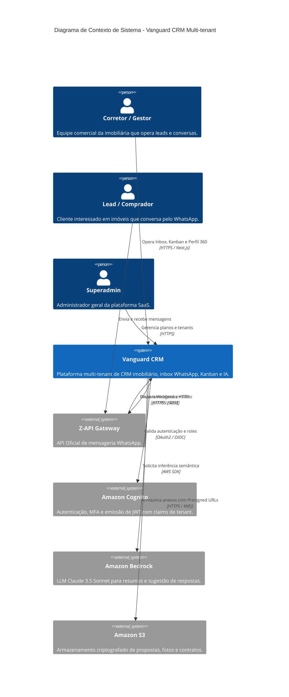
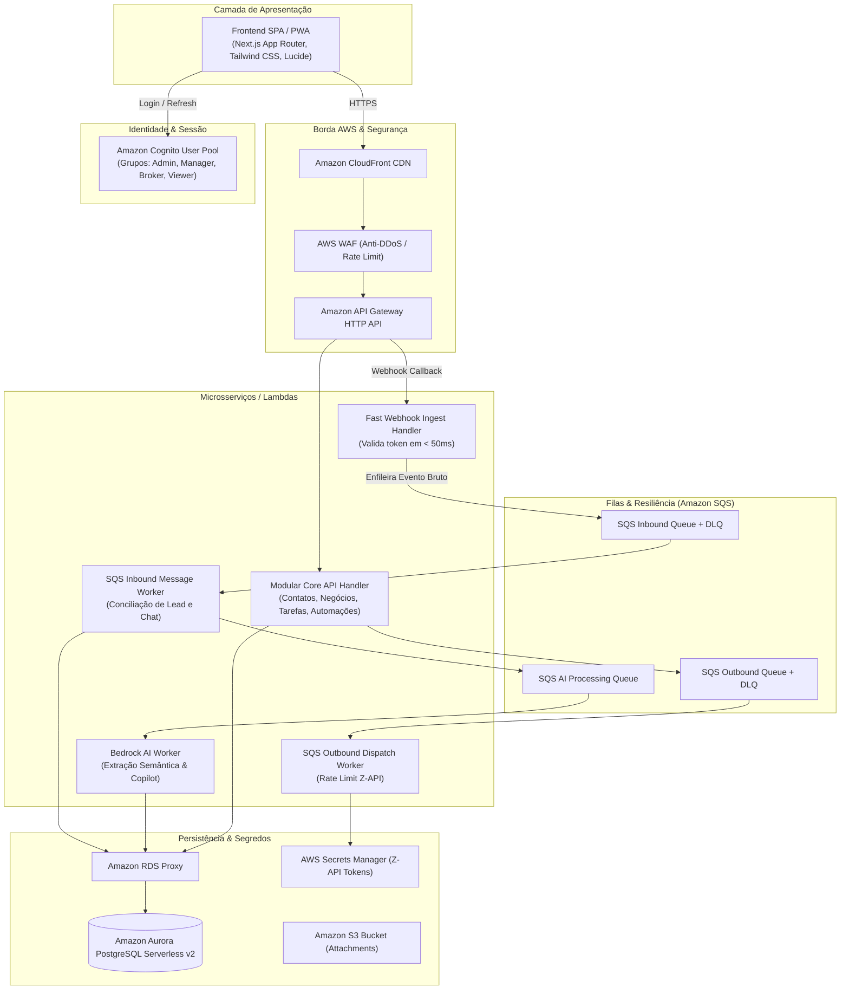
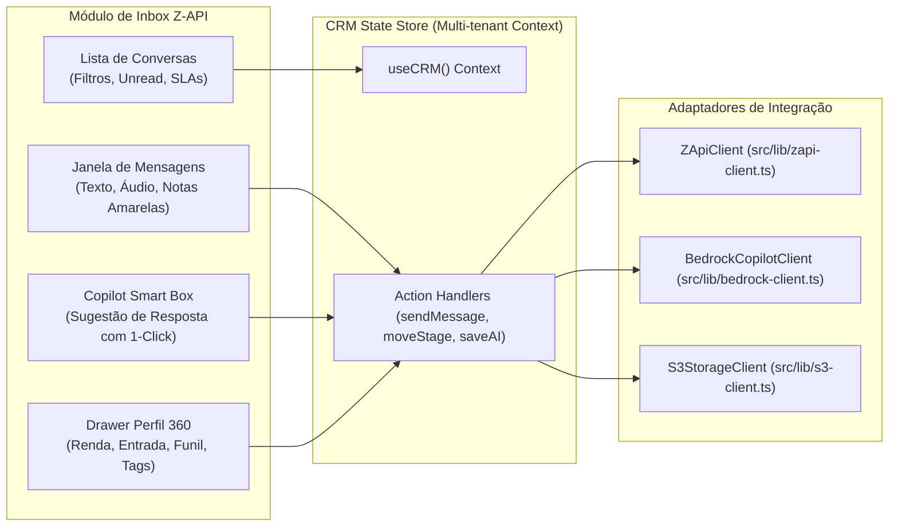

# Arquitetura Técnica & Diagramas C4 — Vanguard CRM Imobiliário

Plataforma SaaS B2B Multiempresa de CRM Imobiliário integrada ao WhatsApp (Z-API) com IA Copiloto (Amazon Bedrock) e infraestrutura AWS Serverless.

---

## 1. Nível 1: Diagrama de Contexto de Sistema (System Context)

---

## 2. Nível 2: Diagrama de Contêineres AWS Serverless

---

## 3. Nível 3: Diagrama de Componentes da Caixa de Entrada WhatsApp

