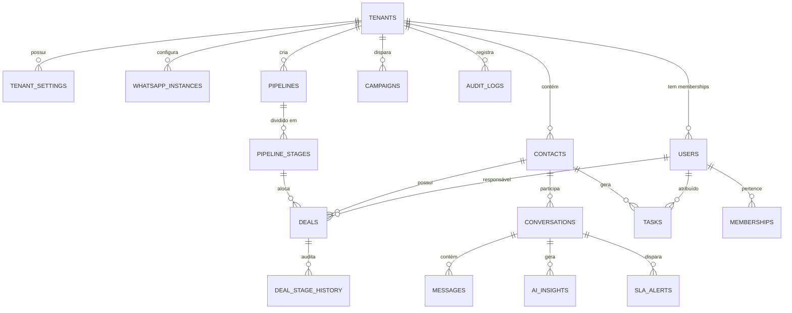

# Modelo de Dados (ER) & Dicionário de Tabelas — Vanguard CRM

Documentação técnica completa do esquema relacional de banco de dados PostgreSQL implementado via Drizzle ORM.

---

## 1. Diagrama Entidade-Relacionamento (Mermaid ER)

---

## 2. Dicionário de Tabelas Principais

### 2.1. Tabela: `tenants` (Empresas / Imobiliárias)
| Coluna | Tipo | Restrições | Descrição |
| :--- | :--- | :--- | :--- |
| `id` | `uuid` | PK, defaultRandom() | Identificador global unívoco do tenant. |
| `name` | `varchar(255)` | NOT NULL | Nome da imobiliária ou grupo imobiliário. |
| `slug` | `varchar(100)` | NOT NULL, UNIQUE | Identificador amigável em URLs e subdomínios. |
| `document_cnpj`| `varchar(20)` | NOT NULL | Cadastro Nacional de Pessoa Jurídica. |
| `logo_url` | `text` | NULL | Link para imagem da logomarca no S3. |
| `primary_color`| `varchar(20)` | default('#059669') | Cor primária da marca para personalização. |
| `timezone` | `varchar(50)` | default('America/Sao_Paulo') | Fuso horário operacional da imobiliária. |
| `business_hours`| `jsonb` | NOT NULL | Horário de atendimento comercial para SLAs. |
| `status` | `varchar(50)` | default('ACTIVE') | Status da conta SaaS (ACTIVE, SUSPENDED). |
| `created_at` | `timestamptz` | defaultNow() | Data de cadastro em UTC. |

---

### 2.2. Tabela: `contacts` (Leads & Clientes 360º)
| Coluna | Tipo | Restrições | Descrição |
| :--- | :--- | :--- | :--- |
| `id` | `uuid` | PK, defaultRandom() | ID do lead. |
| `tenant_id` | `uuid` | FK -> `tenants.id` (INDEX) | Tenant proprietário do contato. |
| `name` | `varchar(255)` | NOT NULL | Nome completo do lead. |
| `phone_normalized`| `varchar(30)` | NOT NULL, UNIQUE(tenant, phone) | Telefone em padrão internacional E.164. |
| `email` | `varchar(255)` | NULL | E-mail do cliente. |
| `cpf_encrypted` | `text` | NULL | CPF criptografado para conformidade LGPD. |
| `monthly_income`| `decimal(14,2)`| NULL | Renda mensal comprovada/declarada. |
| `down_payment_available`| `decimal(14,2)`| NULL | Valor disponível de entrada. |
| `max_property_value`| `decimal(14,2)`| NULL | Teto de orçamento para o imóvel. |
| `preferred_property_type`| `enum` | default('APARTMENT') | APARTMENT, PENTHOUSE, HOUSE, STUDIO, etc. |
| `temperature` | `enum` | default('WARM') | HOT (Quente), WARM (Morno), COLD (Frio). |
| `ai_priority_score`| `integer` | default(70), INDEX | Score heurístico de conversão (0-100). |
| `assigned_user_id`| `uuid` | FK -> `users.id` | Corretor responsável pelo atendimento. |
| `has_opted_out` | `boolean` | default(false) | Bloqueio imediato de mensagens se true. |
| `consent_given` | `boolean` | default(true) | Registro de opt-in e base legal. |

---

### 2.3. Tabela: `deals` (Oportunidades de Negócio no Funil)
| Coluna | Tipo | Restrições | Descrição |
| :--- | :--- | :--- | :--- |
| `id` | `uuid` | PK, defaultRandom() | ID do negócio. |
| `tenant_id` | `uuid` | FK -> `tenants.id` (INDEX) | Tenant proprietário. |
| `contactId` | `uuid` | FK -> `contacts.id` (INDEX) | Lead titular do negócio. |
| `pipeline_id` | `uuid` | FK -> `pipelines.id` | Funil ao qual pertence o negócio. |
| `stage_id` | `uuid` | FK -> `pipeline_stages.id` (INDEX) | Etapa atual do ciclo de vendas. |
| `assigned_user_id`| `uuid` | FK -> `users.id` | Corretor titular da negociação. |
| `title` | `varchar(255)` | NOT NULL | Título do negócio (Ex: Cobertura Horizon). |
| `expected_value`| `decimal(14,2)`| NOT NULL | Valor potencial da transação imobiliária. |
| `status` | `enum` | default('OPEN') | OPEN, WON (Ganho), LOST (Perdido). |
| `closed_at` | `timestamptz` | NULL | Data de fechamento ou perda. |

---

### 2.4. Tabela: `messages` (Mensagens WhatsApp Z-API & Notas Internas)
| Coluna | Tipo | Restrições | Descrição |
| :--- | :--- | :--- | :--- |
| `id` | `uuid` | PK, defaultRandom() | ID interno da mensagem. |
| `tenant_id` | `uuid` | FK -> `tenants.id` (INDEX) | Tenant proprietário. |
| `conversation_id`| `uuid` | FK -> `conversations.id` (INDEX) | Chat de relacionamento. |
| `external_id` | `varchar(128)` | INDEX | ID da mensagem retornado pela Z-API. |
| `sender_type` | `enum` | NOT NULL | CONTACT, USER, SYSTEM, AI_BOT. |
| `message_type` | `enum` | default('TEXT') | TEXT, IMAGE, AUDIO, DOCUMENT, LOCATION. |
| `content` | `text` | NOT NULL | Corpo do texto ou legenda. |
| `status` | `enum` | default('SENT') | PENDING, SENT, DELIVERED, READ, FAILED. |
| `is_internal_note`| `boolean` | default(false) | Se true, NUNCA é enviada ao WhatsApp. |
| `idempotency_key`| `varchar(128)` | UNIQUE(tenant, key) | Chave para proteção contra envios repetidos. |
| `timestamp` | `timestamptz` | defaultNow() | Data/hora do envio/recebimento em UTC. |
