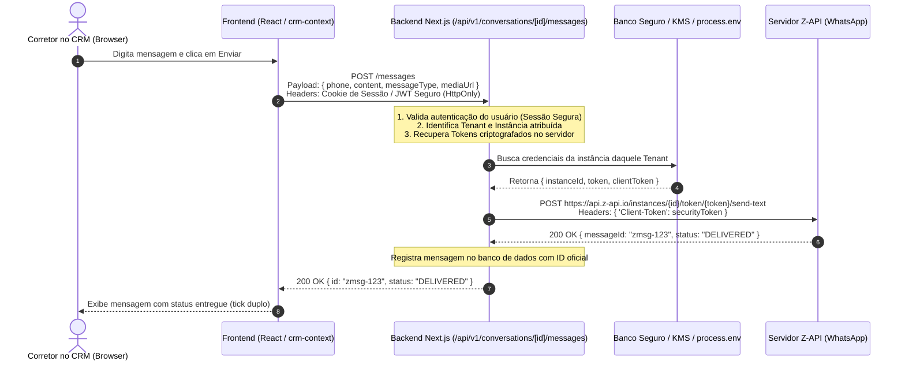

# Documentação Técnica: Orquestração e Isolamento de Tokens Z-API (Backend-Only Secrets)

**Status:** Planejado / Backlog Arquitetural  
**Prioridade:** Alta (Preparação para Modelo Multi-Tenant SaaS Aberto)  
**Data de Registro:** 25/09/2026  
**Contexto:** Transição da arquitetura de mensageria para modelo de Confiança Zero no Cliente (Zero-Trust Frontend).

---

## 1. Visão Geral e Contexto Atual

Atualmente, o CRM opera com envio e recebimento de mensagens através da integração com a **Z-API**.

### Cenário de Transição Atual:
- **Fluxo Operacional:** O frontend ([`crm-context.tsx`](../src/lib/crm-context.tsx)) na função `sendMessage` inclui dados de `instanceId`, `instanceToken` e `clientToken` no corpo da requisição HTTP (`POST /api/v1/conversations/[id]/messages`).
- **Segurança Atual:** O tráfego corre 100% sobre HTTPS (`crm.faithhubs.com`). Os leads/clientes externos não têm acesso a essas chamadas. Senhas e credenciais de usuários são sanitizadas (`sanitizeUser`).
- **Ponto de Melhoria:** Como os tokens trafegam no payload enviado pelo navegador, qualquer usuário logado que inspecione a aba *Network* no DevTools (F12) pode visualizar as credenciais da instância da Z-API.

---

## 2. Objetivo da Refatoração Futura

Eliminar a presença de qualquer segredo, token ou chave de API no código cliente (Frontend/React) e no tráfego de requisições disparadas pelo navegador.

O frontend deve se tornar **completamente agnóstico às credenciais de integração**, enviando apenas intenção de mensagem e dados de negócio.

---

## 3. Diagrama da Arquitetura Alvo (Backend-Only)



---

## 4. Plano de Ação para Implementação Futura

### Etapa 1: Limpeza do Payload no Frontend
No arquivo `src/lib/crm-context.tsx` (na função `sendMessage`):
- **Remover** os campos `instanceId`, `instanceToken` e `clientToken` do payload `JSON.stringify(...)`.
- Enviar estritamente:
  ```typescript
  {
    content: cleanContent || previewText,
    messageType: actualType,
    mediaUrl: attachments?.[0]?.url,
    fileName: attachments?.[0]?.fileName,
    phone: targetPhone,
    senderUserId: currentUser.id,
  }
  ```

### Etapa 2: Gerenciamento Seguro de Credenciais no Backend
No arquivo `src/app/api/v1/conversations/[id]/messages/route.ts`:
- **Remover** a leitura de `instanceId`, `instanceToken` e `clientToken` a partir do `body` da requisição.
- Implementar serviço de resolução de credenciais:
  1. Identificar o `tenantId` da sessão autenticada.
  2. Buscar a instância associada ao corretor ou a instância principal do tenant a partir de tabela segura no banco (`instances`) ou de variáveis de ambiente do servidor (`process.env`).
  3. Criptografar tokens em repouso caso armazenados em banco (usando chave AES-256 via variável `ENCRYPTION_KEY` no servidor).

### Etapa 3: Rota de Configuração e Gerenciamento de Instâncias
- As rotas administrativas que cadastram instâncias (`/api/v1/zapi/instances/create` e `/api/v1/zapi/auto-configure`) devem gravar os tokens diretamente no banco criptografado, sem nunca retornar os tokens em texto plano para o frontend.
- O endpoint de listagem de instâncias deve mascarar tokens:
  ```json
  {
    "id": "inst-1",
    "zapiInstanceId": "3F814449...",
    "hasToken": true,
    "tokenMasked": "550D...BCE5"
  }
  ```

### Etapa 4: Webhooks Inbound (Z-API -> CRM)
- O webhook continua validando a assinatura através do header `Client-Token` comparado em tempo constante (`crypto.timingSafeEqual`) contra o segredo armazenado no servidor, prevenindo timing attacks.

---

## 5. Checklist de Validação de Segurança (DOD - Definition of Done)

- [ ] Nenhuma variável de ambiente pública (`NEXT_PUBLIC_*`) contém tokens da Z-API.
- [ ] O bundle JS compilado (`.next/static`) não contém chaves de API da Z-API em texto fixo.
- [ ] A aba *Network* do navegador não exibe nenhum token no cabeçalho ou corpo de requisições.
- [ ] A rota `POST /api/v1/conversations/[id]/messages` rejeita requisições sem sessão válida e não aceita tokens injetados pelo cliente.
- [ ] Testes unitários cobrindo o envio e recebimento com mocks de servidor sem vazamento de chaves.

---
*Este documento serve como guia definitivo para o endurecimento (hardening) da camada de mensageria quando o CRM for disponibilizado para corretores externos e operações multi-tenant.*
